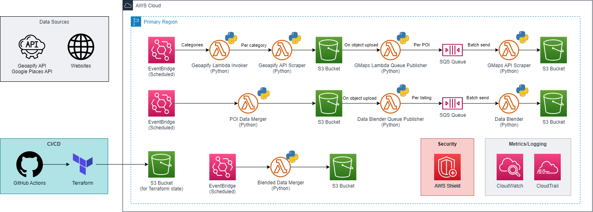

# Stonehenge

## Cloud
**Cloud Deployment:**
The entire cloud infrastructure deployment and configuration has been maintained through [Terraform](https://www.terraform.io/), an Infrastructure-as-code (IaC) tool for ease of maintenance. Deployment is automated through a [GitHub Actions](https://github.com/features/actions) CI/CD workflow. Any updates to the infrastructure can be made to the Terraform files and on trigger of the GitHub Actions workflow, updates will be made to the cloud accordingly.

### Cloud Architecture Diagram

### Environment Variables

*Certain variables have been stored as environment variables for increased security as they are sensitive and not to be leaked*

The following sensitive variables are necessary to be configured as GitHub Actions secrets for the pipeline to work as expected:

| Name | Description |
| ----------- | ----------- |
| ACCESS_KEY | AWS credentials - For use with Terraform to provision resources and with the Lambda functions |
| SECRET_KEY | AWS credentials - For use with Terraform to provision resources and with the Lambda functions |
| GEOAPIFY_API_KEY | API Key for use in API calls to Geoapify |
| GOOGLE_API_KEY | API Key for use in API calls to Google Maps API |

### Setup
1. Add the respective values from the environment variables stated above in the GitHub Actions pipeline as secrets
2. Create an S3 bucket in your AWS account named `stonehenge-fyp`
3. Create a folder called `listings` in the bucket created from **step 2** and upload the listing data from the vendor
4. Trigger the GitHub Actions workflow

As the entire cloud infrastructure setup is automated from the CI/CD pipeline, no further action is needed.

*S3 configuration has not been included in Terraform as it is not ideal to be managed by Terraform due to manual intervention required when trying to delete the infrastructure through Terraform*

## GitHub Actions Workflow
There are 2 different jobs, `Build-Lambda` and `Infrastructure-Update` for the GitHub Actions workflow. It is only triggered on a push to the `main` branch of the repository.

`Build-Lambda` zips up all Lambda functions found in the **API_Scraping_Module** and **Data_Blending_Module** directories into a format compatible for Lambda and uploads them as artifacts.

`Infrastructure-Update` then downloads all of the artifacts from the `Build-Lambda` job and executes the Terraform commands to setup the cloud infrastructure.

### How the data pipeline works
1. The `Geoapify-Lambda-Invoker` Lambda function is triggered by EventBridge Scheduler on 00:00 SGT on the 1st of every month, passing in pre-configured parameters.

2. The `Geoapify-Lambda-Invoker` Lambda function will then take in categories and coordinates from the parameters as arguments and invoke the `Geoapify-API-Scraper` Lambda function once for each category. 

3. The `Geoapify-API-Scraper` will then call the Geoapify API and get the relevant data. The output file will then be stored in S3.

4. As soon as each file is stored in S3, an event will be triggered which triggers the `GMaps-Lambda-Queue-Publisher` Lambda function to take that file and send data of each POI to an SQS queue as a separate record.

5. Once the SQS queue has enough records for a batch or the batching window completes, it will send that batch of records to the `GMaps-API-Scraper` Lambda function, which will then call the Google Maps API to get the relevant data. The output file will then be stored in S3. 

6. **Step 5** is repeated until all POIs have been processed by the `GMaps-API-Scraper` Lambda function. As file names might conflict, we hashed the name of each output file based on the data within the file itself to minimise the chances of this occurring.

7. The `POI-Data-Merger` Lambda function will then be triggered by EventBridge Scheduler on 03:00 SGT on the 1st of every month to take all of the output files and merge them together into a single file, which will be stored in S3.

8. As soon as the merged file from **step 7** is saved into S3, an event will be triggered which triggers the ``Data-Blender`-Queue-Publisher` Lambda function. This function will take each listing from all the vendor data from the listings folder in S3 (manually stored in S3 before the pipeline is triggered), and send data of that listing to an SQS queue as a separate record.

9. Once the SQS queue has enough records for a batch or the batching window completes, it will send that batch of records to the `Data-Blender` Lambda function, which will take the merged output file from **step 7** and blend the data with each record, which will then be stored in S3.

10. **Step 9** is repeated until all listings have been processed by the `Data-Blender` Lambda function. As file names might conflict, we hashed the name of each output file based on the data within the file itself to minimise the chances of this occurring.

11. The `Blended-Data-Merger` Lambda function will then be triggered by EventBridge Scheduler on 06:00 SGT on the 1st of every month to take all of the output files and merge them together into a single file, which will be stored in S3 for data archive purposes. It will also take each original vendor data file from the listings folder in S3 and merge the data together with this new merged file according to the listing that was originally in the vendor data file, which is then stored in S3. This way, the separation of vendor data files will be preserved.